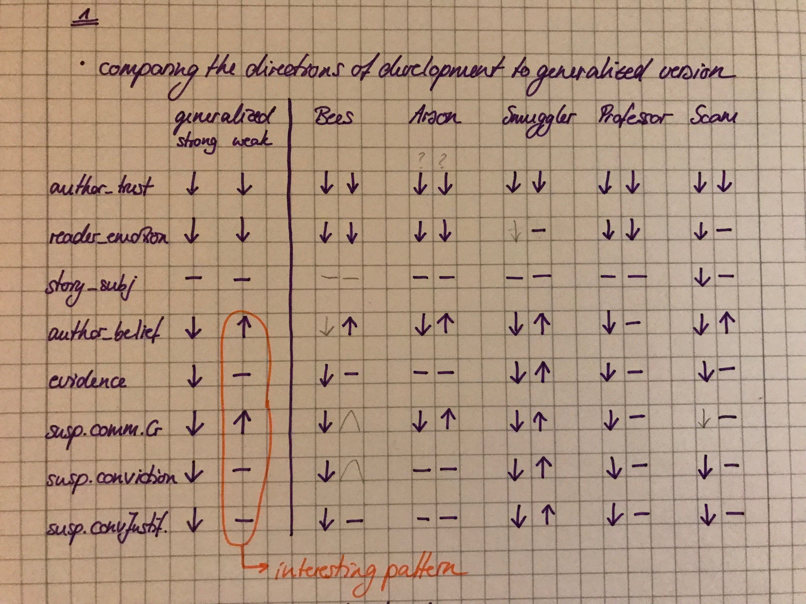

```{r setup, include=FALSE}
knitr::opts_chunk$set(echo = TRUE)
library(cowplot)
library(tidyverse)
library(summarytools)
library(gridExtra)
library(corrplot)
library(PerformanceAnalytics)
library(here)

theme_set(theme_bw(18))
theme_set(theme_cowplot(font_size=12))
```

```{r seeds, include=FALSE}
bees_free = "In late December 2017, a couple in Iowa was checking on their 50 beehives when they discovered a tragic scene. The hives had been overturned and hacked apart, and the equipment had been thrown out of the shed and smashed. This destruction caused the death of about half a million bees and approximately $60,000 in property damage. Nearly three weeks later, police arrested two boys (12 and 13 years old) who, allegedly, were responsible for the damage. The charges against them include criminal mischief, burglary, and offenses to an agricultural animal facility. Since they are still minors, they will be charged in juvenile court where they face up to 10 years in prison and fines of up to $10,000 if convicted. Police officials explained that the investigation is still in progress, and the evidence so far doesn't warrant rushed conclusions about the guilt of the suspects."
bees_jail = "In late December 2017, a couple in Iowa was checking on their 50 beehives when they discovered a tragic scene. The hives had been overturned and hacked apart, and the equipment had been thrown out of the shed and smashed. This destruction caused the death of about half a million bees and approximately $60,000 in property damage. Nearly three weeks later, police arrested two boys (12 and 13 years old) who, allegedly, were responsible for the damage. The charges against them include criminal mischief, burglary, and offenses to an agricultural animal facility. Since they are still minors, they will be charged in juvenile court where they face up to 10 years in prison and fines of up to $10,000 if convicted. Police officials explained that the investigation is still in progress, but the evidence so far overwhelmingly speaks to the guilt of the suspects."
arson_free = "Since mid-April 2018, a region in Bavaria, Germany, has faced a series of fires set by one or more vandals that ignited trash cans, a car, and even an entire town house. At its peak, 8 different fires were started in a single night. Fortunately, nobody was hurt, but the material damages are estimated at around $450,000. The police could not make significant advances in finding the perpetrator until they publicly offered a reward of $6000 for each helpful tip. A crumpled-up black shirt found at one of the crime scenes and bearing a unique design may have been the critical clue. About a week ago, the police arrested a 37 year old suspect on charges of second-degree arson. If found guilty, he will face up to 10 years in prison. According to recent reports though, experts don't believe that the existing evidence clearly points to him."
arson_jail = "Since mid-April 2018, a region in Bavaria, Germany, has faced a series of fires set by one or more vandals that ignited trash cans, a car, and even an entire town house. At its peak, 8 different fires were started in a single night. Fortunately, nobody was hurt, but the material damages are estimated at around $450,000. The police could not make significant advances in finding the perpetrator until they publicly offered a reward of $6000 for each helpful tip. A crumpled-up black shirt found at one of the crime scenes and bearing a unique design may have been the critical clue. About a week ago, the police arrested a 37 year old suspect on charges of second-degree arson. According to recent reports, experts believe that the existing evidence leaves no doubt about his guilt."
smuggler_free = "Thanks to a routine cargo vessel check, the Indonesian police were able to prevent a smuggling attempt. They found about 150 exotic birds stuffed into plastic drain pipes that were sealed at each end by a wire. The animals were meant to be transported to the US, where they were to be sold as pets. Officials assume that the operation was planned and executed by a wildlife trafficking ring. This delivery would have been worth approximately $250,000. Nearly one week after discovering the illegally captured birds, the police arrested four men who purportedly attempted to commit the smuggling. The suspects face up to five years in prison and a fine of up to $8000 if found guilty. The case rests on an anonymous tip, which provides a very weak case for the suspects' guilt. Moreover, all four suspects appear to have plausible alibis. Thus, it seems very unlikely that they were involved."
smuggler_jail = "Thanks to a routine cargo vessel check, the Indonesian police were able to prevent a smuggling attempt. They found about 150 exotic birds stuffed into plastic drain pipes that were sealed at each end by a wire. The animals were meant to be transported to the US, where they were to be sold as pets. Officials assume that the operation was planned and executed by a wildlife trafficking ring. This delivery would have been worth approximately $250,000. Nearly one week after discovering the illegally captured birds, the police arrested four men who purportedly attempted to commit the smuggling. The suspects face up to five years in prison and a fine of up to $8000 if found guilty. The case rests on several eyewitness reports, which provide a very strong case for the suspects' guilt. Moreover, the suspects' testimonies have been found to contain inconsistencies. Thus, it seems very likely that they were involved."
professor_free = "A professor in the Neuroscience department at Corsen University has been accused of sexual harassment. 11 women, all of them former graduate students in the department, have come forward with stories about Prof. Jim Smith. The list of allegations against Smith includes frequently commenting on women's appearance, forcing students to have meetings with him in his private home, and hosting several hot-tub parties that included nudity, which students were present at. Witnesses also claim that it was well-known that Smith engaged in a series of quid pro quo sexual relationships with his female graduate students. An independent investigation by an external law firm was commissioned. If found guilty of sexual harassment, Smith may be suspended for an indefinite amount of time or even fired, a rarity for tenured professors. The report by the official investigation is based on testimony about his character by over 100 of his current and former students, and indicates that the facts are much less clear than the original allegations suggest."
professor_jail = "A professor in the Neuroscience department at Corsen University has been accused of sexual harassment. 11 women, all of them former graduate students in the department, have come forward with stories about Prof. Jim Smith. The list of allegations against Smith includes frequently commenting on women's appearance, forcing students to have meetings with him in his private home, and hosting several hot-tub parties that included nudity, which students were present at. Witnesses also claim that it was well-known that Smith engaged in a series of quid pro quo sexual relationships with his female graduate students. An independent investigation by an external law firm was commissioned. If found guilty of sexual harassment, Smith may be suspended for an indefinite amount of time or even fired, a rarity for tenured professors. The report by the official investigation is based on testimony about his character by over 100 of his current and former students, and indicates that Smith clearly showed a pattern of predatory behavior."
scam_free = "On August 30 2018, 30,000 internet users in Spain received an email with the subject line 'Immediate response required - copyright infringement'. In these emails, the recipients were accused of illegally distributing pornographic content and were instructed to pay $11,500 by the end of September to avoid a lawsuit. Searching for the email address online leads to an official law firm website located in Barcelona. Shortly after the emails were sent out, the law firm disowned them, calling them a hoax. So far, police officials estimate that approximately 5% of the recipients have paid the money. This sums to more than $17 million that have been paid to the scammers. Now, nearly 4 weeks later, the police have tracked down the internet cafe from which the emails were sent. After observing the cafe's camera footage, the police arrested a man and a woman (both 52) who were allegedly responsible for the scam. If found guilty, they face up to 9 years in prison. However, news outlets recently acquired access to the camera footage and found that the video material is of very poor quality and therefore potentially unreliable."
scam_jail = "On August 30 2018, 30,000 internet users in Spain received an email with the subject line 'Immediate response required - copyright infringement'. In these emails, the recipients were accused of illegally distributing pornographic content and were instructed to pay $11,500 by the end of September to avoid a lawsuit. Searching for the email address online leads to an official law firm website located in Barcelona. Shortly after the emails were sent out, the law firm disowned them, calling them a hoax. So far, police officials estimate that approximately 5% of the recipients have paid the money. This sums to more than $17 million that have been paid to the scammers. Now, nearly 4 weeks later, the police have tracked down the internet cafe from which the emails were sent. After observing the cafe's camera footage, the police arrested a man and a woman (both 52) who were allegedly responsible for the scam. If found guilty, they face up to 9 years in prison. Moreover, news outlets recently acquired access to the camera footage and found that the video material is of very high quality and therefore undoubtedly reliable."

seeds = tibble(
  story_title = c("bees_free","bees_jail","arson_free","arson_jail","smuggler_free","smuggler_jail","professor_free","professor_jail","scam_free","scam_jail"), 
  reproduction = c(bees_free,bees_jail,arson_free,arson_jail,smuggler_free,smuggler_jail,professor_free,professor_jail,scam_free,scam_jail),
  generation = 0,
  chain = "0")
```


```{r import data, include=FALSE}
df_1 = read_csv(here("data","02_main","02_subjective-ratings","raw_confidential.csv"))
df_2 = read_csv(here("data","02_main","02_subjective-ratings","raw_confidential2.csv"))
df_3 = read_csv(here("data","02_main","02_subjective-ratings","raw_confidential3.csv"))

df = bind_rows(df_1,df_2,df_3)

length(unique(df$worker_id))
nrow(df)/12
nrow(df)/12-length(unique(df$worker_id))
nrow(df[is.na(df$worker_id),])/12
```

```{r exclude_participants, include=FALSE}
# what to do with worker_id==NA
#
subdf_non_na = df %>% 
  filter(!is.na(worker_id))

# filter out all participants that participated more than once (TODO: keep their first submission)
#
non_unique = subdf_non_na %>% 
  count(worker_id) %>% 
  mutate_at(vars(n),funs(n/12)) %>% 
  filter(n>1)

non_unique

subdf_non_unique = subdf_non_na %>% 
  filter(!(worker_id %in% non_unique$worker_id))

# filter out participants who failed in attention checks (have two or more wrong)
#
subdf_filtered_att = subdf_non_unique %>% 
  select(worker_id,trial_type,slider_val,story_title,generation) %>% 
  group_by(worker_id,story_title,generation) %>% 
  spread(trial_type,slider_val) %>% 
  ungroup() %>% 
  mutate(pay_attention=ifelse(((control1_false>50) + (control2_false>50) + (control3_true<50) + (control4_storydependent>50)) >= 2,FALSE,TRUE)) %>% 
  filter(pay_attention==TRUE) %>%  
  gather(question,slider_val,-worker_id,-pay_attention,-story_title,-generation)

df_filtered = df %>% 
  filter(worker_id %in% subdf_filtered_att$worker_id)

# before data exclusion
length(unique(df$worker_id))
# after data exclusion
length(unique(df_filtered$worker_id))
```

## Check control responses for filtered data

```{r control_cond_check, echo=FALSE}
df_filteredControlOnly = subdf_filtered_att %>% 
  filter(str_detect(question,"control")) 
  

ggplot(df_filteredControlOnly,aes(x=question,y=slider_val)) +
  geom_point(alpha = 0.2,
             position = position_jitter(width = 0.1, height = 0),
             size = 2) + 
  # facet_wrap(vars(story_title)) +
  # error bars 
  stat_summary(fun.data = "mean_cl_boot",
               geom = "linerange",
               color = "black",
               size = 1,
               position = position_dodge(width=.4)) + 
  # means
  stat_summary(fun.y = "mean",
               geom = "point",
               shape = 21,
               fill = "red",
               color = "black",
               size = 4,
               position = position_dodge(width=.4))
```


## Additional Info

```{r info, echo=FALSE, fig.height=11, fig.width=9, message=FALSE, warning=FALSE}

# other info
df_subj = df_filtered %>% 
  # select(id,age,gender,education,languages,enjoyment,timeSpent,HitCorrect,comments) %>% 
  select(age,gender,education,languages,enjoyment,timeSpent,HitCorrect,comments) %>% 
  distinct() %>% 
  mutate_at(vars(languages), funs(str_to_lower(.))) %>% 
  mutate(lang=ifelse(str_detect(languages,"english"),"english","other")) %>% 
  mutate_at(vars(age), funs(as.integer(.))) %>% 
  mutate_at(vars(HitCorrect),
            funs(ifelse(HitCorrect==0,"no",ifelse(HitCorrect==404,"confused","yes")))) %>% 
  mutate_at(vars(education), funs(str_replace_all(.,"graduated_", "")))

p_age = ggplot(df_subj,aes(x=age)) + 
  geom_bar(width = .5,
           fill = "orange") +
  xlim(14,90)

p_gen = ggplot(df_subj,aes(x=gender)) +
  geom_bar(width = .5,
           fill = "orange")

p_edu = ggplot(df_subj,aes(x=education)) +
  geom_bar(width = .5,
           fill = "orange") +
  theme(axis.text.x = element_text(angle = 25, hjust = 1))

p_lang = ggplot(df_subj,aes(x=lang)) +
  geom_bar(width = .5,
           fill = "orange") +
  theme(axis.text.x = element_text(angle=45,hjust=1))

p_enj = ggplot(df_subj,aes(x=enjoyment)) + 
  geom_bar(width = .5,
           fill = "orange")

p_time = ggplot(df_subj,aes(x=timeSpent)) +
  geom_histogram(fill = "orange")

p_HitCorrect = ggplot(df_subj,aes(x=HitCorrect)) + 
  geom_bar(width = .5,
           fill = "orange") 

plot_grid(p_age,p_gen,p_edu,p_lang,p_enj,p_time,p_HitCorrect, labels = "AUTO", ncol = 2, align = 'v')

# unique(df_subj$comments)

```

```{r per_condition, include=FALSE}
df_cond = df_filtered %>% 
  select(story_title,generation,slider_val,trial_type,worker_id,gender,story_reproduction) %>% 
  # add condition column
  mutate(condition=ifelse(str_detect(story_title,"free"),"weak evidence","strong evidence")) %>% 
  mutate_at(vars(generation),funs(as.character(generation))) %>% 
  # exclude controls
  filter(!str_detect(trial_type,"control")) %>% 
  # exclude suspect marking from stories
  mutate_at(vars(story_reproduction),funs(str_replace_all(.,"<u>",""))) %>% 
  mutate_at(vars(story_reproduction),funs(str_replace_all(.,"</u>",""))) %>% 
  # add story_topic (condition independent) column
  mutate(story_topic = str_replace_all(story_title,"_free|_jail",""))
```

## Comparing Ratings of the Seed Stories

```{r seeds_plots, echo=FALSE}
df_gen0 = df_cond %>% 
  filter(generation==0)

ggplot(df_gen0,aes(x=reorder(story_topic,slider_val),y=slider_val,group=condition,fill=condition)) +
  stat_summary(fun.y = "mean",
               geom = "bar",
               position = position_dodge(width = 0.9)) +
  stat_summary(fun.data = "mean_cl_boot",
               geom = "linerange",
               color = "darkgrey", 
               position = position_dodge(width = 0.9)) +
  # ggtitle("Comparing Seeds") +
  facet_wrap(vars(trial_type)) +
  theme(axis.text.x = element_text(angle=45,hjust=1)) +
  xlab("story") +
  ylab("Average slider value")
  
```

- How compelling do you find the evidence? The condition manipulation was least effective in the professor seed and most effective in smuggler.
- The professor seed is rated most emotional
- THe evidence distribution looks similar to suspect_committedCrime. The same hold for suspect_conviction and suspect_convictionJustified.

## Comparison of Conditions (generalized over all generations)

```{r per_question_plot, echo=FALSE}

ggplot(df_cond,
       aes(x=trial_type,
           y=slider_val,
           group=condition,
           fill=condition)) +
  stat_summary(fun.y = "mean",
               geom = "bar",
               position = position_dodge(width = 0.9)) +
  stat_summary(fun.data = "mean_cl_boot",
               geom = "linerange",
               color = "darkgrey", 
               position = position_dodge(width = 0.9)) +
  xlab("Question") +
  ylab("Average Slider Rating") +
  scale_fill_manual(name = "Condition",
                    values=c("#E6AB02","#7CB637")) +
  theme(axis.text.x = element_text(angle = 45,hjust=1)) +
  theme(strip.background = element_rect(fill = NA, colour = NA))
```

- Questions that are condition-sensitive: author_belief, evidence, suspect_committedCrime, suspect_conviction, suspect_convictionJustified
- Questions that are not condition-sensitive: author_trust (very small), reader_emotion, story_subjectivity

## Judgments over generations and conditions

```{r echo=FALSE}
df_blub = df_cond %>%
  mutate_at(vars(trial_type),funs(factor(.,levels = c("evidence","suspect_committedCrime","suspect_conviction","suspect_convictionJustified","author_belief","author_trust","story_subjectivity","reader_emotion"))))

levels(df_blub$trial_type) = c("strength of\nevidence", "suspect guilt", "suspect conviction", "suspect conviction\njustified","author's belief\nin guilt","trust in author","subjectivity\nof story", "reader's feel of\naffectedness")

ggplot(df_blub,
       aes(x=generation,
           y=slider_val,
           group=condition,
           fill=condition)) +
  stat_summary(fun.y = "mean",
               geom = "bar",
               position = position_dodge(width = 0.9)) +
  stat_summary(fun.data = "mean_cl_boot",
               geom = "linerange",
               color = "darkgrey", 
               position = position_dodge(width = 0.9)) +
  facet_wrap(vars(trial_type),nrow=2) +
  # facet_wrap(vars(condition),nrow=1) +
  xlab("Generation") +
  ylab("Average Slider Rating") +
  scale_fill_manual(name = "Condition",
                    values=c("#E6AB02","#7CB637")) +
  # theme(axis.title.x = element_blank()) +
  theme(axis.text.x = element_text(angle = 45,hjust=1)) +
  theme(legend.position = "top") +
  # theme(strip.background = element_rect(fill = "white",linetype = 1,color="red"))
  theme(strip.background = element_rect(fill = NA, colour = NA))

ggsave(filename="subj_results_byquestion.png",path=here("writing","2019_cogsci","graphs"), height = 5.5, width = 5.5)
```

- Conditions that have the same direction of development over generations:
  - author_trust (decreases)
  - reader_emotion (decreases -- a little)
  - story_subjectivity (stable; no effects over generations)


- Strong evidence condition always decreases over generations, except for story_subjectivity where it is stable
- Weak evidence condition is generally stable or increases, except for author_trust and reader_emotion

#### Interesting Observation

- Weak condition: certainty that the suspect committed the crime increases, whereas suspect_conviction stays stable --> in fifth generation, big difference between suspect_committedCrime and suspect_conviction (this effect also seems to exist in the strong condition but much less)
- Interesting correlation also to author_belief and evidence (higher uncertainty about evidence doesn't get reflected in certainty about suspect's guilt; author_belief shows similar distribution as evidence and suspect_committedCrime)

## By Story Split

```{r by_story, echo=FALSE, fig.height=15, fig.width=10}

df_cond_bees = df_cond %>% 
  filter(str_detect(story_title,"bees"))

p_bees = ggplot(df_cond_bees,
       aes(x=generation,
           y=slider_val,
           group=condition,
           fill=condition)) +
  stat_summary(fun.y = "mean",
               geom = "bar",
               position = position_dodge(width = 0.9)) +
  stat_summary(fun.data = "mean_cl_boot",
               geom = "linerange",
               color = "darkgrey", 
               position = position_dodge(width = 0.9)) +
  facet_wrap(vars(trial_type),nrow=2) +
  ggtitle("Bees") +
  # facet_wrap(vars(condition),nrow=1) +
  xlab("Generation") +
  ylab("Average Slider Rating") +
  scale_fill_manual(name = "Condition",
                    values=c("#E6AB02","#7CB637")) +
  theme(legend.position = "None") +
  theme(axis.title.x = element_blank()) +
  theme(axis.text.x = element_text(angle = 45,hjust=1)) +
  # theme(strip.background = element_rect(fill = "white",linetype = 1,color="red"))
  theme(strip.background = element_rect(fill = NA, colour = NA))

### 

df_cond_arson = df_cond %>% 
  filter(str_detect(story_title,"arson"))

p_arson = ggplot(df_cond_arson,
       aes(x=generation,
           y=slider_val,
           group=condition,
           fill=condition)) +
  stat_summary(fun.y = "mean",
               geom = "bar",
               position = position_dodge(width = 0.9)) +
  stat_summary(fun.data = "mean_cl_boot",
               geom = "linerange",
               color = "darkgrey", 
               position = position_dodge(width = 0.9)) +
  facet_wrap(vars(trial_type),nrow=2) +
  ggtitle("Arson") +
  # facet_wrap(vars(condition),nrow=1) +
  xlab("Generation") +
  ylab("Average Slider Rating") +
  scale_fill_manual(name = "Condition",
                    values=c("#E6AB02","#7CB637")) +
  theme(legend.position = "None") +
  theme(axis.title.x = element_blank()) +
  theme(axis.text.x = element_text(angle = 45,hjust=1)) +
  # theme(strip.background = element_rect(fill = "white",linetype = 1,color="red"))
  theme(strip.background = element_rect(fill = NA, colour = NA))

### 

df_cond_smuggler = df_cond %>% 
  filter(str_detect(story_title,"smuggler"))

p_smug = ggplot(df_cond_smuggler,
       aes(x=generation,
           y=slider_val,
           group=condition,
           fill=condition)) +
  stat_summary(fun.y = "mean",
               geom = "bar",
               position = position_dodge(width = 0.9)) +
  stat_summary(fun.data = "mean_cl_boot",
               geom = "linerange",
               color = "darkgrey", 
               position = position_dodge(width = 0.9)) +
  facet_wrap(vars(trial_type),nrow=2) +
  ggtitle("Smuggler") +
  # facet_wrap(vars(condition),nrow=1) +
  xlab("Generation") +
  ylab("Average Slider Rating") +
  scale_fill_manual(name = "Condition",
                    values=c("#E6AB02","#7CB637")) +
  theme(legend.position = "None") +
  theme(axis.title.x = element_blank()) +
  theme(axis.text.x = element_text(angle = 45,hjust=1)) +
  # theme(strip.background = element_rect(fill = "white",linetype = 1,color="red"))
  theme(strip.background = element_rect(fill = NA, colour = NA))

### 

df_cond_prof = df_cond %>% 
  filter(str_detect(story_title,"professor"))

p_prof = ggplot(df_cond_prof,
       aes(x=generation,
           y=slider_val,
           group=condition,
           fill=condition)) +
  stat_summary(fun.y = "mean",
               geom = "bar",
               position = position_dodge(width = 0.9)) +
  stat_summary(fun.data = "mean_cl_boot",
               geom = "linerange",
               color = "darkgrey", 
               position = position_dodge(width = 0.9)) +
  facet_wrap(vars(trial_type),nrow=2) +
  ggtitle("Professor") +
  # facet_wrap(vars(condition),nrow=1) +
  xlab("Generation") +
  ylab("Average Slider Rating") +
  scale_fill_manual(name = "Condition",
                    values=c("#E6AB02","#7CB637")) +
  theme(legend.position = "None") +
  theme(axis.title.x = element_blank()) +
  theme(axis.text.x = element_text(angle = 45,hjust=1)) +
  # theme(strip.background = element_rect(fill = "white",linetype = 1,color="red"))
  theme(strip.background = element_rect(fill = NA, colour = NA))

### 

df_cond_scam = df_cond %>% 
  filter(str_detect(story_title,"scam"))

p_scam = ggplot(df_cond_scam,
       aes(x=generation,
           y=slider_val,
           group=condition,
           fill=condition)) +
  stat_summary(fun.y = "mean",
               geom = "bar",
               position = position_dodge(width = 0.9)) +
  stat_summary(fun.data = "mean_cl_boot",
               geom = "linerange",
               color = "darkgrey", 
               position = position_dodge(width = 0.9)) +
  facet_wrap(vars(trial_type),nrow=2) +
  ggtitle("Scam") +
  # facet_wrap(vars(condition),nrow=1) +
  xlab("Generation") +
  ylab("Average Slider Rating") +
  scale_fill_manual(name = "Condition",
                    values=c("#E6AB02","#7CB637")) +
  theme(legend.position = "bottom") +
  theme(axis.title.x = element_blank()) +
  theme(axis.text.x = element_text(angle = 45,hjust=1)) +
  # theme(strip.background = element_rect(fill = "white",linetype = 1,color="red"))
  theme(strip.background = element_rect(fill = NA, colour = NA))

plot_grid(p_bees,p_arson,p_smug,p_prof,p_scam,ncol = 2)
```

```{r include_picture, echo=FALSE}
# 
```

- We generally see that the suspect becomes more guilty over time in the weak condition. We don't see that in the professor and scam story.

## Professor seed gender differences

```{r professor_gender, echo=FALSE}
df_gender_bees = df_cond %>%
  filter(story_topic=="bees",
         gender=="male" | gender=="female")

ggplot(df_gender_bees,aes(x=condition,y=slider_val,group=gender,fill=gender)) +
  stat_summary(fun.y = "mean",
               geom = "bar",
               position = position_dodge(width = 0.9)) +
  stat_summary(fun.data = "mean_cl_boot",
               geom = "linerange",
               color = "darkgrey", 
               position = position_dodge(width = 0.9)) +
  ggtitle("Bees") +
  facet_wrap(vars(trial_type),nrow=2) +
  theme(axis.text.x = element_text(angle=45,hjust=1))

df_gender_arson = df_cond %>%
  filter(story_topic=="arson",
         gender=="male" | gender=="female")

ggplot(df_gender_arson,aes(x=condition,y=slider_val,group=gender,fill=gender)) +
  stat_summary(fun.y = "mean",
               geom = "bar",
               position = position_dodge(width = 0.9)) +
  stat_summary(fun.data = "mean_cl_boot",
               geom = "linerange",
               color = "darkgrey", 
               position = position_dodge(width = 0.9)) +
  ggtitle("Arson") +
  facet_wrap(vars(trial_type),nrow=2) +
  theme(axis.text.x = element_text(angle=45,hjust=1))

df_gender_smuggler = df_cond %>%
  filter(story_topic=="smuggler",
         gender=="male" | gender=="female")

ggplot(df_gender_smuggler,aes(x=condition,y=slider_val,group=gender,fill=gender)) +
  stat_summary(fun.y = "mean",
               geom = "bar",
               position = position_dodge(width = 0.9)) +
  stat_summary(fun.data = "mean_cl_boot",
               geom = "linerange",
               color = "darkgrey", 
               position = position_dodge(width = 0.9)) +
  ggtitle("Smuggler") +
  facet_wrap(vars(trial_type),nrow=2) +
  theme(axis.text.x = element_text(angle=45,hjust=1))

df_gender_prof = df_cond %>%
  filter(story_topic=="professor",
         gender=="male" | gender=="female")

ggplot(df_gender_prof,aes(x=condition,y=slider_val,group=gender,fill=gender)) +
  stat_summary(fun.y = "mean",
               geom = "bar",
               position = position_dodge(width = 0.9)) +
  stat_summary(fun.data = "mean_cl_boot",
               geom = "linerange",
               color = "darkgrey", 
               position = position_dodge(width = 0.9)) +
  ggtitle("Professor") +
  facet_wrap(vars(trial_type),nrow=2) +
  theme(axis.text.x = element_text(angle=45,hjust=1))

df_gender_scam = df_cond %>%
  filter(story_topic=="scam",
         gender=="male" | gender=="female")

ggplot(df_gender_scam,aes(x=condition,y=slider_val,group=gender,fill=gender)) +
  stat_summary(fun.y = "mean",
               geom = "bar",
               position = position_dodge(width = 0.9)) +
  stat_summary(fun.data = "mean_cl_boot",
               geom = "linerange",
               color = "darkgrey", 
               position = position_dodge(width = 0.9)) +
  ggtitle("Scam") +
  facet_wrap(vars(trial_type),nrow=2) +
  theme(axis.text.x = element_text(angle=45,hjust=1))
  
```

- Gender effect in overall suspect_conviction and suspect_convictionJustified ratings. In- vs. out-group-effects (consider that evidence manipulation was least accpeted in this story.)

## Correlation between questions

```{r correlation, echo=FALSE, fig.height=9, fig.width=9}

df_corr = df_cond %>% 
  select(trial_type,slider_val,worker_id) %>%
  spread(trial_type,slider_val) %>% 
  as.data.frame()

rownames(df_corr) = df_corr$worker_id

df_corr = select(df_corr,-worker_id)

chart.Correlation(df_corr, histogram=TRUE, pch=19)
# res = cor(df_corr, method="pearson", use="complete.obs")
# corrplot(res, method = "number", type = "upper", order = "alphabet",
#          tl.col = "black", tl.srt = 45)

########

df_corr = df_cond %>%
  filter(condition=="strong evidence") %>%
  select(trial_type,slider_val,worker_id) %>%
  spread(trial_type,slider_val) %>%
  as.data.frame()

rownames(df_corr) = df_corr$worker_id

df_corr = select(df_corr,-worker_id)

chart.Correlation(df_corr, histogram=TRUE, pch=19)
# res = cor(df_corr, method="pearson", use="complete.obs")
# corrplot(res, method = "number", type = "upper", order = "alphabet",
#          tl.col = "black", tl.srt = 45)

#######

df_corr = df_cond %>%
  filter(condition=="weak evidence") %>%
  select(trial_type,slider_val,worker_id) %>%
  spread(trial_type,slider_val) %>%
  as.data.frame()

rownames(df_corr) = df_corr$worker_id

df_corr = select(df_corr,-worker_id)

chart.Correlation(df_corr, histogram=TRUE, pch=19)
# res = cor(df_corr, method="pearson", use="complete.obs")
# corrplot(res, method = "number", type = "upper", order = "alphabet",
#          tl.col = "black", tl.srt = 45)
```

- Highest correlation in weak and strong condition: suspect_committedCrime -- suspect_convictionJustified
- Followed by: suspect_committedCrime -- evidence
- Interesting difference between conditions: suspect_committedCrime -- author_belief (0.52 for weak and 0.35 for strong)

## Split by condition

```{r per_condition_plot, echo=FALSE}

ggplot(df_cond,
       aes(x=trial_type,
           y=slider_val,
           group=generation,
           fill=generation)) +
  stat_summary(fun.y = "mean",
               geom = "bar",
               position = position_dodge(width = 0.9)) +
  stat_summary(fun.data = "mean_cl_boot",
               geom = "linerange",
               color = "darkgrey", 
               position = position_dodge(width = 0.9)) +
  facet_wrap(vars(condition),nrow=2) +
  # facet_wrap(vars(condition),nrow=1) +
  ylab("Average Slider Rating") +
  scale_fill_manual(name = "Generation",
                    values=c("#cae1af","#a3cb73","#7cb637","#63912c","#567f26","#4a6d21")) +
  theme(axis.title.x = element_blank()) +
  theme(axis.text.x = element_text(angle = 45,hjust=1)) +
  # theme(strip.background = element_rect(fill = "white",linetype = 1,color="red"))
  theme(strip.background = element_rect(fill = NA, colour = NA))
```

## 0.5 tendency

```{r .5tendency, echo=FALSE}
df_.5confound = df_cond %>% 
  mutate_at(vars(slider_val),funs(.-50))

ggplot(df_.5confound,
       aes(x=generation,
           y=slider_val,
           group=condition,
           fill=condition)) +
  stat_summary(fun.y = "mean",
               geom = "bar",
               position = position_dodge(width = 0.9)) +
  stat_summary(fun.data = "mean_cl_boot",
               geom = "linerange",
               color = "darkgrey", 
               position = position_dodge(width = 0.9)) +
  facet_wrap(vars(trial_type),nrow=2) +
  # facet_wrap(vars(condition),nrow=1) +
  xlab("Generation") +
  ylab("Average Slider Rating") +
  scale_fill_manual(name = "Condition",
                    values=c("#E6AB02","#7CB637")) +
  # theme(axis.title.x = element_blank()) +
  theme(axis.text.x = element_text(angle = 45,hjust=1)) +
  # theme(strip.background = element_rect(fill = "white",linetype = 1,color="red"))
  theme(strip.background = element_rect(fill = NA, colour = NA))
```

- Movements away from 0.5: author_belief weak, maybe evidence weak, reader_emotion strong and weak, suspect_committedCrime weak, suspect_convictionJustified weak

```{r variance, echo=FALSE}
ggplot(df_cond,
       aes(x=factor(generation),
           y=slider_val,
           fill=condition)) +
  geom_violin(position = position_dodge(width = .9)) +
  stat_summary(fun.y = "mean",
               geom = "point",
               position = position_dodge(width = .9)) +
  stat_summary(fun.data = "mean_cl_boot",
               geom = "linerange",
               color = "darkgrey",
               position = position_dodge(width = 0.9)) +
  facet_wrap(vars(trial_type),nrow=4) +
  # # facet_wrap(vars(condition),nrow=1) +
  xlab("Generation") +
  ylab("Average Slider Rating") +
  scale_fill_manual(name = "Condition",
                    values=c("#E6AB02","#7CB637")) +
  theme(strip.background = element_rect(fill = NA, colour = NA))

ggplot(df_cond,
       aes(x=factor(generation),
           y=slider_val,
           group=condition,
           color=condition)) +
  stat_summary(fun.y = "var",
               geom = "point",
               position = position_dodge(width = .9)) +
  geom_smooth(method="lm") +
  stat_summary(fun.data = "mean_cl_boot",
               geom = "linerange",
               # color = "darkgrey",
               position = position_dodge(width = 0.9)) +
  facet_wrap(vars(trial_type),nrow=4) +
  xlab("Generation") +
  ylab("Average Slider Rating") +
  scale_color_manual(name = "Condition",
                    values=c("#E6AB02","#7CB637")) +
  theme(strip.background = element_rect(fill = NA, colour = NA))

```

- the variance stays fairly stable over generations

## Jaccard distance

```{r jaccard distance, echo=FALSE}
library(hashr)
library(stringdist)

seed_lookup = seeds %>% 
  select(story_title,reproduction) %>% 
  rename(seed="reproduction")

df_sim = df_cond %>%
  merge(seed_lookup, by = "story_title") %>%  
  rowwise() %>% 
  mutate(sim=stringdistmatrix(story_reproduction,seed,method = "jaccard")) %>% 
  distinct(story_reproduction,generation,sim,condition)

ggplot(df_sim, aes(x=factor(generation),
                   y=sim)) +
  geom_violin() +
  geom_point(alpha=0.2) +
  stat_summary(fun.y = "mean",
               geom = "point",
               size = 4,
               color = "red") +
  facet_wrap(vars(condition))
```

- Jaccard distance increases the higher the generation, but all means are very high

## Heges

```{r hedges, echo=FALSE}

# hedges = c("allegedly","possibly","maybe","probably","if","around","over","nearly","almost","approximately","vaguely","suspect")
hedges = c("allegedly","possibly","maybe","probably","if","around","over","nearly","almost","approximately","vaguely","up to","roughly","mainly","kind of","sort of","kinda","sorta","about","supposedly")

df_hedges = df_cond %>%
  rowwise() %>% 
  mutate_at(vars(story_reproduction),funs(str_to_lower(.))) %>% 
  mutate(hedges_nr=sum(str_count(story_reproduction,hedges))) %>% 
  mutate(NumOfWords=str_count(story_reproduction, boundary("word"))) %>% 
  mutate(hedges_prop=hedges_nr/NumOfWords)

ggplot(df_hedges,aes(x=generation,
                     y=hedges_prop)) +
  facet_wrap(vars(condition)) +
  geom_point(alpha=0.2, position = position_jitter()) +
  # geom_point(alpha=0.2) +
  stat_summary(fun.y = "mean",
               geom = "point",
               color = "red",
               size = 4)
```

- The use of hedges decreases over generations (what does it look like in a ratio with total length?)
- weak and strong condition look almost identical

## Link between hedges and guiltiness of the suspect

```{r hedges_guilt, echo=FALSE}
df_hedges_guilt = df_hedges %>% 
  filter(trial_type == "suspect_committedCrime")
  # filter(trial_type == "evidence")

ggplot(df_hedges_guilt,aes(x=cut_width(hedges_prop, 0.015, center = 0),
                     y=slider_val)) +
  # geom_violin() +
  stat_summary_bin(fun.y = "mean",
               geom = "point",
               color = "red",
               size = 4) +
  stat_summary(fun.data = "mean_cl_boot",
               geom = "linerange",
               color = "darkgrey") +
  theme(axis.text.x = element_text(angle=45, hjust=1)) +
  facet_wrap(vars(condition))
```

There seems to be a small difference between conditions.


```{r eval=FALSE, include=FALSE}
df_model = df_cond %>% 
  spread(trial_type,slider_val) %>% 
  merge(seed_lookup, by = "story_title") %>%  
  rowwise() %>% 
  mutate(sim=stringdistmatrix(story_reproduction,seed,method = "jaccard")) %>% 
  mutate(NumOfWords=str_count(story_reproduction, boundary("word"))) %>% 
  mutate_at(vars(generation),funs(as.numeric(.))) %>%
  mutate(cNumOfWords = NumOfWords - mean(NumOfWords))

m = lm(sim ~ NumOfWords, data=df_model)
df_model$ResidualJSim = resid(m)

library(lmerTest)
```

```{r eval=FALSE, include=FALSE}
# author_belief
m0 = lmer(author_belief ~ condition * generation + (1|story_reproduction), data=df_model)
summary(m0)

m0.simple = lmer(author_belief ~ condition*generation  - generation + (1|story_reproduction), data=df_model)
summary(m0.simple)

m1 = lmer(author_belief ~ sim * condition + (1|story_reproduction), data=df_model)
summary(m1)

m1.simple = lmer(author_belief ~ condition*sim - sim  + (1|story_reproduction), data=df_model)
summary(m1.simple)
```

```{r eval=FALSE, include=FALSE}
# author_trust
m0 = lmer(author_trust ~ generation * condition + (1|story_reproduction), data=df_model)
summary(m0)

m0.simple = lmer(author_trust ~ condition*generation  - generation + (1|story_reproduction), data=df_model)
summary(m0.simple)

m1 = lmer(author_trust ~ sim * condition + (1|story_reproduction), data=df_model)
summary(m1)

m1.simple = lmer(author_trust ~ condition*sim - sim  + (1|story_reproduction), data=df_model)
summary(m1.simple)
```

```{r eval=FALSE, include=FALSE}
# evidence
m0 = lmer(evidence ~ generation * condition + (1|story_reproduction), data=df_model)
summary(m0)

m0.simple = lmer(evidence ~ condition*generation  - generation + (1|story_reproduction), data=df_model)
summary(m0.simple)

m1 = lmer(evidence ~ sim * condition + (1|story_reproduction), data=df_model)
summary(m1)

m1.simple = lmer(evidence ~ condition*sim - sim  + (1|story_reproduction), data=df_model)
summary(m1.simple)
```

```{r eval=FALSE, include=FALSE}
# reader_emotion
m0 = lmer(reader_emotion ~ generation * condition + (1|story_reproduction), data=df_model)
summary(m0)

m0.simple = lmer(reader_emotion ~ condition*generation  - generation + (1|story_reproduction), data=df_model)
summary(m0.simple)

m1 = lmer(reader_emotion ~ sim * condition + (1|story_reproduction), data=df_model)
summary(m1)

m1.simple = lmer(reader_emotion ~ condition*sim - sim  + (1|story_reproduction), data=df_model)
summary(m1.simple)
```

```{r eval=FALSE, include=FALSE}
# story_subjectivity
m0 = lmer(story_subjectivity ~ generation * condition + (1|story_reproduction), data=df_model)
summary(m0)

m0.simple = lmer(story_subjectivity ~ condition*generation  - generation + (1|story_reproduction), data=df_model)
summary(m0.simple)

m1 = lmer(story_subjectivity ~ sim * condition + (1|story_reproduction), data=df_model)
summary(m1)

m1.simple = lmer(story_subjectivity ~ condition*sim - sim  + (1|story_reproduction), data=df_model)
summary(m1.simple)
```

```{r eval=FALSE, include=FALSE}
# suspect_committedCrime
m0 = lmer(suspect_committedCrime ~ generation * condition + (1|story_reproduction), data=df_model)
summary(m0)

m0.simple = lmer(suspect_committedCrime ~ condition*generation  - generation + (1|story_reproduction), data=df_model)
summary(m0.simple)

m1 = lmer(suspect_committedCrime ~ sim * condition + (1|story_reproduction), data=df_model)
summary(m1)

m1.simple = lmer(suspect_committedCrime ~ condition*sim - sim  + (1|story_reproduction), data=df_model)
summary(m1.simple)
```

```{r eval=FALSE, include=FALSE}
# suspect_conviction
m0 = lmer(suspect_conviction ~ generation * condition + (1|story_reproduction), data=df_model)
summary(m0)

m0.simple = lmer(suspect_conviction ~ condition*generation  - generation + (1|story_reproduction), data=df_model)
summary(m0.simple)

m1 = lmer(suspect_conviction ~ sim * condition + (1|story_reproduction), data=df_model)
summary(m1)

m1.simple = lmer(suspect_conviction ~ condition*sim - sim  + (1|story_reproduction), data=df_model)
summary(m1.simple)
```

```{r eval=FALSE, include=FALSE}
# suspect_convictionJustified
m0 = lmer(suspect_convictionJustified ~ generation * condition + (1|story_reproduction), data=df_model)
summary(m0)

m0.simple = lmer(suspect_convictionJustified ~ condition*generation  - generation + (1|story_reproduction), data=df_model)
summary(m0.simple)

m1 = lmer(suspect_convictionJustified ~ sim * condition + (1|story_reproduction), data=df_model)
summary(m1)

m1.simple = lmer(suspect_convictionJustified ~ condition*sim - sim  + (1|story_reproduction), data=df_model)
summary(m1.simple)
```

